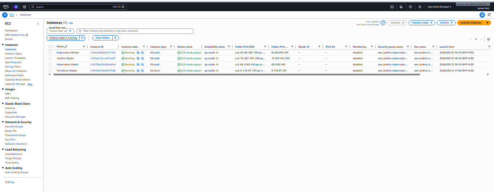
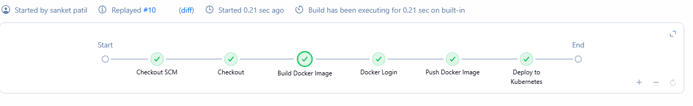
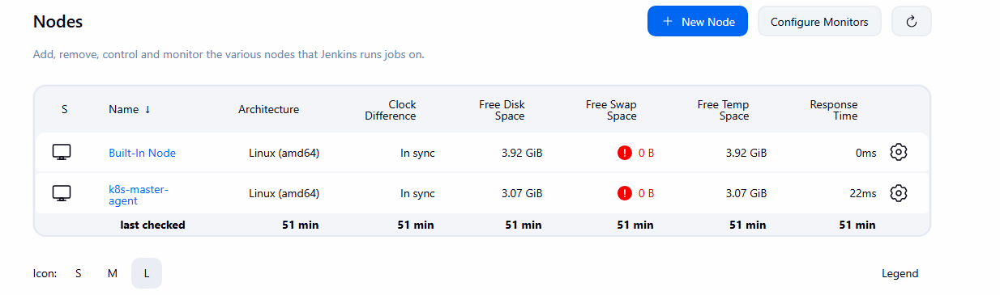
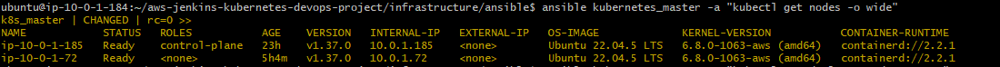
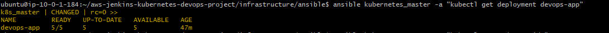
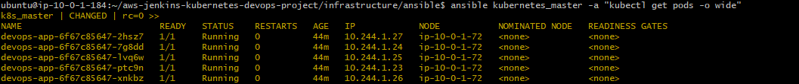
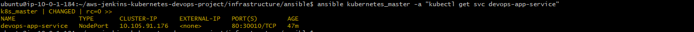
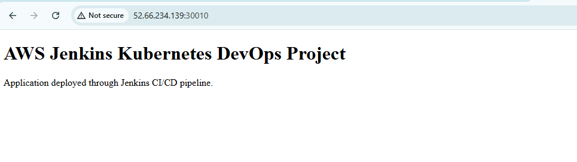

# AWS Jenkins Kubernetes DevOps Project

End-to-end DevOps automation project that provisions AWS infrastructure with **Terraform**, configures servers with **Ansible**, builds and publishes Docker images through **Jenkins**, and deploys the application to a self-managed **Kubernetes** cluster.

## Architecture

```text
Developer
   |
   v
GitHub Repository
   |
   v
Jenkins Master
   |
   | SSH
   v
Kubernetes Control Plane
+ Jenkins Agent
   |
   +---- Docker Build
   |
   +---- Docker Hub Push
   |
   v
Kubernetes Cluster
   |
   +---- Control Plane
   |
   +---- Worker Node
            |
            +---- 5 Application Pods
   |
   v
NodePort Service :30010
   |
   v
Browser
```

## Project Workflow

1. Terraform provisions the AWS network and EC2 infrastructure.
2. Ansible configures Jenkins and the Kubernetes nodes.
3. Jenkins checks out the application source code from GitHub.
4. Jenkins builds a Docker image using the application Dockerfile.
5. Jenkins authenticates to Docker Hub using credentials stored in Jenkins.
6. The image is pushed using the Jenkins build number and `latest` tags.
7. Jenkins applies the Kubernetes manifests.
8. Jenkins updates the Kubernetes Deployment to the new image version.
9. Kubernetes performs a rolling rollout across five application replicas.
10. The application is exposed through NodePort `30010`.

## AWS Infrastructure

The current Terraform configuration creates four EC2 instances:

| Instance | Size | Purpose |
|---|---|---|
| Terraform Master | `t3.micro` | Terraform and Ansible control node |
| Jenkins Master | `t3.small` | Jenkins controller |
| Kubernetes Master | `t3.small` | Kubernetes control plane and Jenkins agent |
| Kubernetes Worker | `t3.small` | Kubernetes workload node |

The Terraform configuration also provisions:

- VPC: `10.0.0.0/16`
- Public subnet: `10.0.1.0/24`
- Internet Gateway
- Public route table
- Security group
- EC2 key pair
- Public and private IP outputs

The default AWS region is `ap-south-1`.

## Terraform

Terraform code is stored under:

```text
infrastructure/terraform/
```

Important files include:

```text
data.tf
keypair.tf
network.tf
nodes.tf
outputs.tf
provider.tf
security.tf
terraform-master.tf
variables.tf
```

Typical Terraform workflow:

```bash
terraform init
terraform fmt
terraform validate
terraform plan
terraform apply
```

Terraform state files and `.tfvars` files are excluded from Git using `.gitignore`.

## Ansible Automation

Ansible runs from the Terraform control node and manages the Jenkins and Kubernetes EC2 instances.

The active inventory is stored at:

```text
infrastructure/ansible/inventory/hosts
```

The implemented playbooks are:

```text
infrastructure/ansible/playbook/
├── jenkins-master.yml
├── jenkins-slave.yml
├── kubernetes-common.yml
├── kubernetes-install.yml
└── kubernetes-master.yml
```

The Ansible automation performs tasks including:

- Java 21 installation
- Jenkins installation and service startup
- Docker installation for the Jenkins agent
- containerd installation and configuration
- swap disablement for Kubernetes
- Kubernetes kernel and sysctl configuration
- kubeadm, kubelet and kubectl installation
- Kubernetes control-plane initialization
- Jenkins agent preparation

Ansible connectivity can be checked with:

```bash
ansible all -m ping
```

## Jenkins Architecture

Jenkins runs on a dedicated EC2 instance.

The Kubernetes control-plane instance is also configured as a Jenkins agent with the label:

```text
k8s-agent
```

The Jenkins agent provides the execution environment required by the pipeline, including Java, Docker, kubectl and access to the Kubernetes cluster.

## Jenkins CI/CD Pipeline

The repository contains a declarative `Jenkinsfile` with these stages:

```text
Checkout
   |
   v
Build Docker Image
   |
   v
Docker Login
   |
   v
Push Docker Image
   |
   v
Deploy to Kubernetes
```

The pipeline performs the following actions:

- checks out the source repository
- builds the Docker image
- tags the image with `$BUILD_NUMBER` and `latest`
- authenticates to Docker Hub using Jenkins credentials
- pushes both image tags
- applies the Kubernetes Deployment and Service manifests
- updates `deployment/devops-app` to the newly built image
- waits for the Kubernetes rollout to complete

Docker Hub image repository:

```text
sanket9401/aws-jenkins-kubernetes-devops-project
```

> The current repository contains the Jenkins pipeline itself. Automatic build-on-push through a GitHub webhook is not documented here unless that trigger is separately configured in Jenkins/GitHub.

## Application Container

The sample application is an Nginx-based static web application.

```text
application/
├── Dockerfile
└── index.html
```

Dockerfile:

```dockerfile
FROM nginx:alpine

COPY index.html /usr/share/nginx/html/index.html

EXPOSE 80
```

## Kubernetes

The Kubernetes cluster is self-managed using `kubeadm` and contains:

- 1 control-plane node
- 1 worker node
- containerd runtime
- Flannel CNI
- CoreDNS
- kube-proxy

The control plane is initialized with pod CIDR:

```text
10.244.0.0/16
```

### Deployment

The application Deployment is defined in:

```text
kubernetes/deployment.yaml
```

It runs five replicas:

```yaml
replicas: 5
```

The default image configured in the manifest is:

```text
sanket9401/aws-jenkins-kubernetes-devops-project:latest
```

### Service

The application Service is defined in:

```text
kubernetes/service.yaml
```

Configuration:

```text
Type       : NodePort
Service    : devops-app-service
Port       : 80
TargetPort : 80
NodePort   : 30010
```

The deployed application can be accessed using:

```text
http://<KUBERNETES-NODE-PUBLIC-IP>:30010
```

## Verification Commands

```bash
kubectl get nodes -o wide
kubectl get deployment devops-app
kubectl get pods -o wide
kubectl get svc devops-app-service
```

Expected Deployment state:

```text
NAME         READY   UP-TO-DATE   AVAILABLE
devops-app   5/5     5            5
```

Expected Service mapping:

```text
NAME                 TYPE       PORT(S)
devops-app-service   NodePort   80:30010/TCP
```

## Project Structure

```text
aws-jenkins-kubernetes-devops-project/
├── application/
│   ├── Dockerfile
│   └── index.html
├── assets/
│   ├── application-live.png
│   ├── aws-ec2-instances.png
│   ├── jenkins-agent-online.png
│   ├── jenkins-success.png
│   ├── kubernetes-deployment.png
│   ├── kubernetes-nodes.png
│   ├── kubernetes-pods.png
│   └── kubernetes-service.png
├── infrastructure/
│   ├── ansible/
│   │   ├── ansible.cfg
│   │   ├── inventory/
│   │   │   └── hosts
│   │   └── playbook/
│   │       ├── jenkins-master.yml
│   │       ├── jenkins-slave.yml
│   │       ├── kubernetes-common.yml
│   │       ├── kubernetes-install.yml
│   │       └── kubernetes-master.yml
│   └── terraform/
│       ├── data.tf
│       ├── keypair.tf
│       ├── network.tf
│       ├── nodes.tf
│       ├── outputs.tf
│       ├── provider.tf
│       ├── security.tf
│       ├── terraform-master.tf
│       └── variables.tf
├── kubernetes/
│   ├── deployment.yaml
│   └── service.yaml
├── scripts/
├── .gitignore
├── Jenkinsfile
└── README.md
```

## Project Validation

### AWS EC2 Infrastructure



### Jenkins Pipeline Success



### Jenkins Agent Online



### Kubernetes Nodes



### Kubernetes Deployment



### Kubernetes Pods



### Kubernetes Service



### Live Application



## Security Notes

This project is designed as a hands-on lab environment. The current Terraform security group allows SSH (`22`), Jenkins (`8080`) and the application NodePort (`30010`) from `0.0.0.0/0`, so the configuration should not be treated as production-ready.

For production, improve the design by:

- placing internal workloads in private subnets
- restricting SSH and Jenkins access to trusted sources
- using separate security groups for each server role
- using IAM roles with least privilege
- using AWS Systems Manager where possible instead of public SSH access
- storing secrets in a dedicated secrets manager
- avoiding direct private-key storage on control hosts
- using encrypted remote Terraform state with locking
- adding TLS/HTTPS, ingress/load balancing, monitoring and centralized logging
- considering Amazon EKS for managed Kubernetes workloads

## What This Project Demonstrates

- Terraform-based AWS infrastructure provisioning
- AWS VPC, subnet, routing and EC2 configuration
- Ansible-based configuration management
- Jenkins controller/agent architecture
- Jenkins declarative CI/CD pipelines
- Docker image build and registry integration
- Kubernetes cluster bootstrap with kubeadm
- containerd and Flannel networking
- Kubernetes Deployments and Services
- rolling application deployment
- Git-based DevOps workflow

## Result

The completed pipeline demonstrates this end-to-end flow:

```text
GitHub
   ↓
Jenkins
   ↓
Docker Build
   ↓
Docker Hub
   ↓
Kubernetes Deployment
   ↓
5 Application Replicas
   ↓
NodePort :30010
   ↓
Web Application
```

A Jenkins build can package the application, push a versioned Docker image to Docker Hub, deploy the image to Kubernetes and verify the rollout.

## Author

**Sanket Patil**

DevOps Engineer | AWS | Terraform | Ansible | Jenkins | Docker | Kubernetes
